# Microsoft library — technology overview

Auto-generated inventory of every `technology` term declared in `microsoft.todl`, grouped by the section headers in the source file. Each entry shows the icon, the TODL identifier, and the label used in the toolbox / diagrams.

## Microsoft 365

| Icon | Identifier | Label |
| --- | --- | --- |
|  | `microsoft_graph` | Microsoft Graph |
|  | `microsoft_teams` | Microsoft Teams |
| 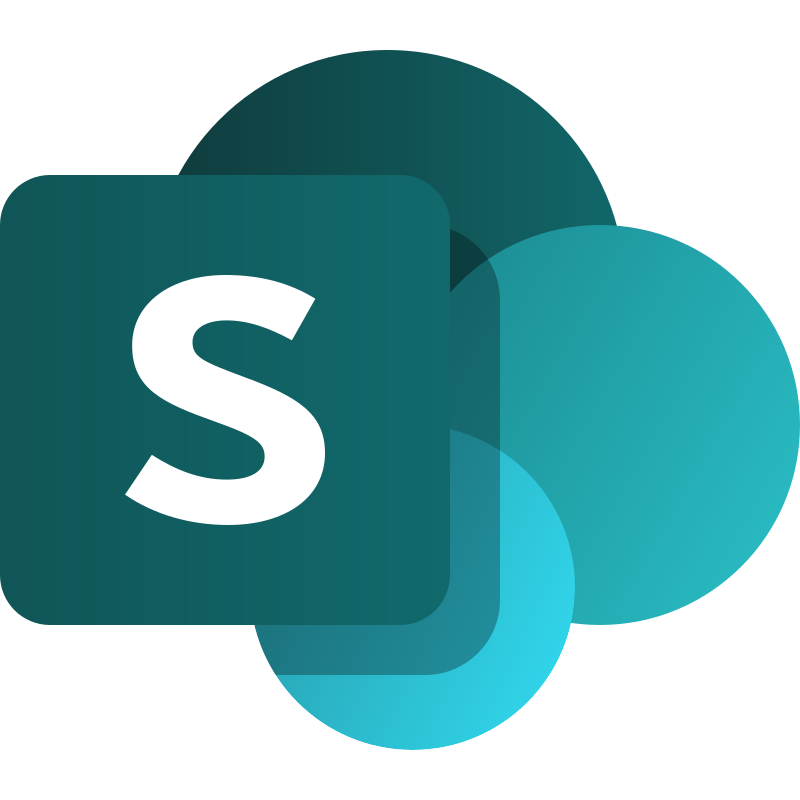 | `sharepoint_online` | SharePoint |
|  | `sharepoint_embedded` | SharePoint Embedded |
|  | `m365_copilot` | M365 Copilot |
|  | `dynamics_365` | Dynamics 365 |

## Power Platform

| Icon | Identifier | Label |
| --- | --- | --- |
|  | `copilot_studio` | Copilot Studio |
|  | `copilot_agent` | Copilot Agent |
|  | `power_automate` | Power Automate |
|  | `power_bi` | Power BI |
|  | `dataverse` | Microsoft Dataverse |
|  | `microsoft_work_iq` | Microsoft Work IQ |
|  | `microsoft_autonomous_agent` | Microsoft Autonomous Agent |

## Azure

| Icon | Identifier | Label |
| --- | --- | --- |
|  | `azure_ai_search` | Azure AI Search |
| 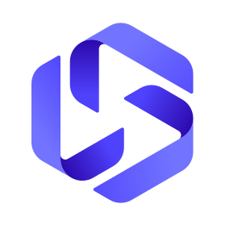 | `ai_foundry_agent_svc` | Foundry Agent Service |
|  | `ai_foundry_multi_agent` | AI Foundry Multi-Agent |
|  | `ai_foundry_iq` | Foundry IQ |
|  | `azure_openai_gpt4o` | Azure OpenAI GPT-4o |
|  | `azure_event_hub` | Azure Event Hub |
|  | `azure_service_bus` | Azure Service Bus |
| 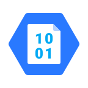 | `azure_blob_storage` | Azure Blob Storage |
|  | `azure_sql` | Azure SQL |
|  | `microsoft_fabric` | Microsoft Fabric |
|  | `onelake` | OneLake |

## Microsoft Foundry Platform

| Icon | Identifier | Label |
| --- | --- | --- |
| 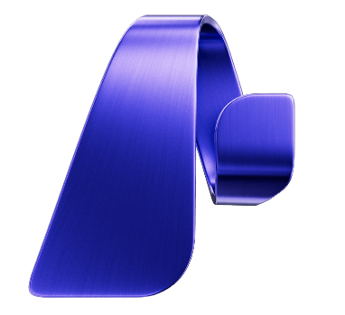 | `microsoft_foundry` | Microsoft Foundry |
|  | `foundry_control_plane` | Foundry Control Plane |
| 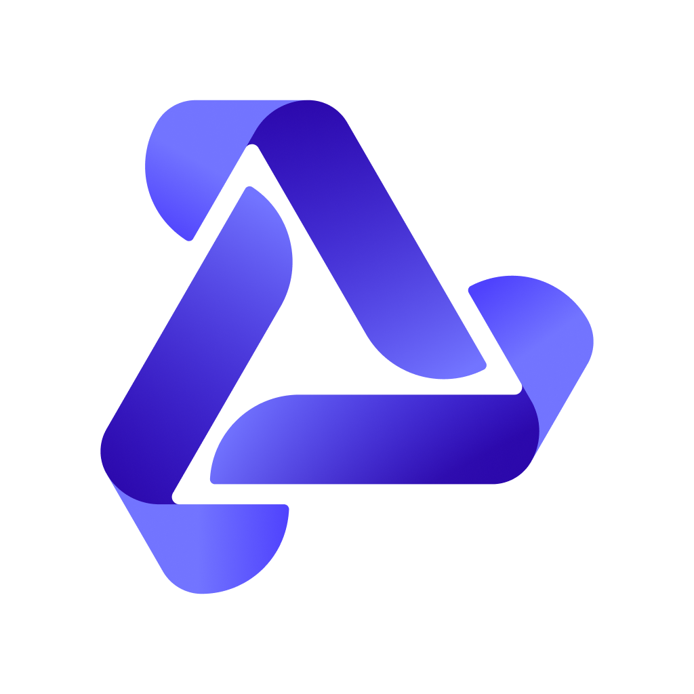 | `foundry_models` | Foundry Models |
|  | `foundry_local` | Foundry Local |
|  | `ai_red_teaming_agent` | AI Red Teaming Agent |

## Azure AI / Foundry Tools

| Icon | Identifier | Label |
| --- | --- | --- |
|  | `azure_ai_content_safety` | Azure AI Content Safety |
|  | `azure_ai_immersive_reader` | Azure AI Immersive Reader |
|  | `azure_content_understanding` | Azure Content Understanding |
|  | `azure_document_intelligence` | Azure Document Intelligence |
|  | `azure_face` | Azure AI Face |
|  | `azure_language` | Azure AI Language |
| 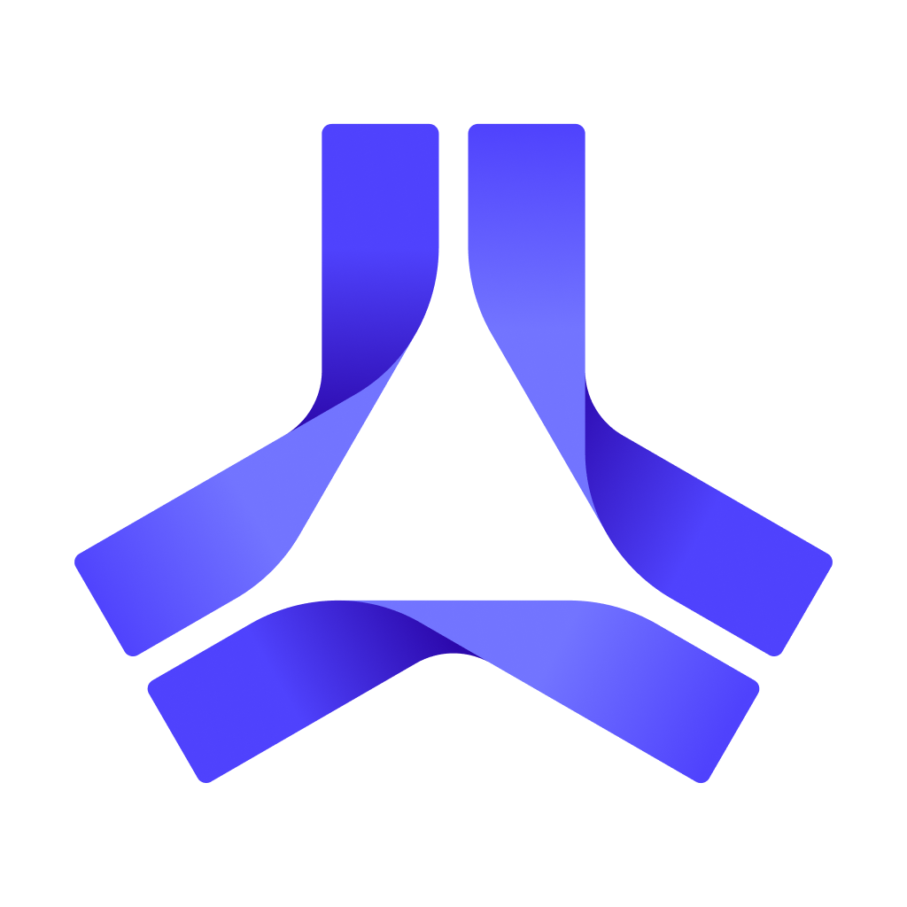 | `azure_machine_learning` | Azure Machine Learning |
|  | `azure_speech` | Speech |
|  | `azure_translator` | Translator |
|  | `azure_vision` | Vision |

## Azure AI / Foundry Tools (expanded)

| Icon | Identifier | Label |
| --- | --- | --- |
|  | `azure_ai_bot_service` | Azure AI Bot Service |
|  | `azure_ai_custom_vision` | Azure AI Custom Vision |
|  | `azure_ai_foundry_models` | Azure AI Foundry Models |
|  | `azure_ai_services` | Azure AI Services |
|  | `azure_ai_video_indexer` | Azure AI Video Indexer |
|  | `azure_openai_service` | Azure OpenAI Service |
|  | `foundry_tools` | Foundry Tools |
|  | `health_bot` | Health Bot |
|  | `azure_databricks` | Azure Databricks |
|  | `azure_open_datasets` | Azure Open Datasets |
|  | `data_science_vms` | Data Science Virtual Machines |

## Compute

| Icon | Identifier | Label |
| --- | --- | --- |
|  | `app_service` | App Service |
|  | `azure_virtual_machines` | Azure Virtual Machines |
|  | `virtual_machine_scale_sets` | Virtual Machine Scale Sets |
|  | `azure_spot_virtual_machines` | Azure Spot Virtual Machines |
|  | `azure_dedicated_host` | Azure Dedicated Host |
|  | `azure_compute_fleet` | Azure Compute Fleet |
|  | `azure_functions` | Azure Functions |
|  | `azure_cyclecloud` | Azure CycleCloud |
|  | `azure_service_fabric` | Azure Service Fabric |
|  | `azure_spring_apps` | Azure Spring Apps |
|  | `azure_virtual_desktop` | Azure Virtual Desktop |
|  | `azure_vmware_solution` | Azure VMware Solution |
|  | `azure_quantum` | Azure Quantum |
|  | `batch` | Batch |
|  | `cloud_services` | Cloud Services |
|  | `sql_server_on_vms` | SQL Server on Virtual Machines |
|  | `static_web_apps` | Static Web Apps |

## Containers

| Icon | Identifier | Label |
| --- | --- | --- |
|  | `azure_container_apps` | Azure Container Apps |
|  | `azure_container_instances` | Azure Container Instances |
|  | `azure_container_registry` | Azure Container Registry |
|  | `azure_container_storage` | Azure Container Storage |
|  | `azure_kubernetes_service` | Azure Kubernetes Service (AKS) |
|  | `azure_kubernetes_fleet_manager` | Azure Kubernetes Fleet Manager |
|  | `azure_red_hat_openshift` | Azure Red Hat OpenShift |
|  | `web_app_for_containers` | Web App for Containers |

## Databases

| Icon | Identifier | Label |
| --- | --- | --- |
|  | `azure_cache_for_redis` | Azure Cache for Redis |
|  | `azure_managed_redis` | Azure Managed Redis |
|  | `azure_cosmos_db` | Azure Cosmos DB |
|  | `azure_database_for_mariadb` | Azure Database for MariaDB |
|  | `azure_database_for_mysql` | Azure Database for MySQL |
|  | `azure_database_for_postgresql` | Azure Database for PostgreSQL |
|  | `azure_database_migration_service` | Azure Database Migration Service |
|  | `azure_documentdb` | Azure DocumentDB |
|  | `azure_managed_instance_apache_cassandra` | Azure Managed Instance for Apache Cassandra |
|  | `azure_sql_database` | Azure SQL Database |
|  | `azure_sql_managed_instance` | Azure SQL Managed Instance |
|  | `table_storage` | Table Storage |

## Storage

| Icon | Identifier | Label |
| --- | --- | --- |
|  | `archive_storage` | Archive Storage |
|  | `azure_backup` | Azure Backup |
|  | `azure_data_box` | Azure Data Box |
|  | `azure_data_lake_storage` | Azure Data Lake Storage |
|  | `azure_disk_storage` | Azure Disk Storage |
|  | `azure_elastic_san` | Azure Elastic SAN |
|  | `azure_files` | Azure Files |
|  | `azure_managed_lustre` | Azure Managed Lustre |
|  | `azure_netapp_files` | Azure NetApp Files |
|  | `azure_storage_actions` | Azure Storage Actions |
|  | `queue_storage` | Queue Storage |
|  | `storage_explorer` | Storage Explorer |

## Networking

| Icon | Identifier | Label |
| --- | --- | --- |
|  | `application_gateway` | Application Gateway |
|  | `azure_ddos_protection` | Azure DDoS Protection |
|  | `azure_dns` | Azure DNS |
|  | `azure_expressroute` | Azure ExpressRoute |
|  | `azure_firewall` | Azure Firewall |
|  | `azure_front_door` | Azure Front Door |
|  | `azure_private_link` | Azure Private Link |
|  | `load_balancer` | Load Balancer |
|  | `nat_gateway` | NAT Gateway |
|  | `virtual_network` | Virtual Network |
|  | `virtual_wan` | Virtual WAN |
|  | `vpn_gateway` | VPN Gateway |
|  | `web_application_firewall` | Web Application Firewall |

## Integration

| Icon | Identifier | Label |
| --- | --- | --- |
|  | `api_management` | API Management |
|  | `app_configuration` | App Configuration |
|  | `azure_api_for_fhir` | Azure API for FHIR |
|  | `azure_data_manager_for_agriculture` | Azure Data Manager for Agriculture |
|  | `azure_health_data_services` | Azure Health Data Services |
|  | `azure_logic_apps` | Azure Logic Apps |
|  | `azure_web_pubsub` | Azure Web PubSub |
|  | `event_grid` | Event Grid |
|  | `event_hubs` | Event Hubs |

## Analytics

| Icon | Identifier | Label |
| --- | --- | --- |
|  | `azure_analysis_services` | Azure Analysis Services |
|  | `azure_chaos_studio` | Azure Chaos Studio |
|  | `azure_data_explorer` | Azure Data Explorer |
|  | `azure_data_factory` | Azure Data Factory |
|  | `azure_data_lake_analytics` | Azure Data Lake Analytics |
|  | `azure_stream_analytics` | Azure Stream Analytics |
|  | `azure_synapse_analytics` | Azure Synapse Analytics |
|  | `hdinsight` | HDInsight |
|  | `microsoft_purview` | Microsoft Purview |
|  | `power_bi_embedded` | Power BI Embedded |

## Identity

| Icon | Identifier | Label |
| --- | --- | --- |
|  | `azure_information_protection` | Azure Information Protection |
|  | `microsoft_entra_domain_services` | Microsoft Entra Domain Services |
|  | `microsoft_entra_external_id` | Microsoft Entra External ID |
|  | `microsoft_entra_id` | Microsoft Entra ID |

## Security

| Icon | Identifier | Label |
| --- | --- | --- |
|  | `azure_confidential_ledger` | Azure confidential ledger |
|  | `azure_dedicated_hsm` | Azure Dedicated HSM |
|  | `azure_key_vault` | Azure Key Vault |
|  | `microsoft_defender_for_cloud` | Microsoft Defender for Cloud |
|  | `microsoft_defender_easm` | Microsoft Defender for External Attack Surface Management |
|  | `microsoft_defender_for_iot` | Microsoft Defender for IoT |
|  | `microsoft_sentinel` | Microsoft Sentinel |

## Internet of Things

| Icon | Identifier | Label |
| --- | --- | --- |
|  | `azure_digital_twins` | Azure Digital Twins |
|  | `azure_iot` | Azure IoT |
|  | `azure_iot_central` | Azure IoT Central |
|  | `azure_iot_edge` | Azure IoT Edge |
|  | `azure_iot_hub` | Azure IoT Hub |
|  | `azure_iot_operations` | Azure IoT Operations |
|  | `azure_maps` | Azure Maps |
|  | `azure_sphere` | Azure Sphere |
|  | `notification_hubs` | Notification Hubs |
|  | `windows_10_iot_core_services` | Windows 10 IoT Core Services |
|  | `windows_for_iot` | Windows for IoT |

## Hybrid + Multicloud

| Icon | Identifier | Label |
| --- | --- | --- |
|  | `azure_arc` | Azure Arc |
|  | `aks_edge_essentials` | Azure Kubernetes Service Edge Essentials |
|  | `azure_local` | Azure Local |
|  | `azure_operator_nexus` | Azure Operator Nexus |
|  | `azure_operator_service_manager` | Azure Operator Service Manager |
|  | `azure_stack_edge` | Azure Stack Edge |
|  | `azure_stack_hub` | Azure Stack Hub |

## Web

| Icon | Identifier | Label |
| --- | --- | --- |
|  | `azure_communication_services` | Azure Communication Services |
|  | `azure_fluid_relay` | Azure Fluid Relay |
|  | `azure_signalr_service` | Azure SignalR Service |

## Media

| Icon | Identifier | Label |
| --- | --- | --- |
|  | `azure_media_player` | Azure Media Player |
|  | `content_protection` | Content Protection |
|  | `encoding` | Encoding |
|  | `live_on_demand_streaming` | Live and On-Demand Streaming |
|  | `media_services` | Media Services |

## Developer Tools

| Icon | Identifier | Label |
| --- | --- | --- |
|  | `azure_artifacts` | Azure Artifacts |
|  | `azure_boards` | Azure Boards |
|  | `azure_devops` | Azure DevOps |
|  | `azure_devtest_labs` | Azure DevTest Labs |
|  | `azure_pipelines` | Azure Pipelines |
|  | `azure_repos` | Azure Repos |
|  | `azure_test_plans` | Azure Test Plans |
|  | `azure_app_testing` | Azure App Testing |
|  | `azure_deployment_environments` | Azure Deployment Environments |
|  | `microsoft_dev_box` | Microsoft Dev Box |
|  | `microsoft_playwright_testing` | Microsoft Playwright Testing |

## Management and Governance

| Icon | Identifier | Label |
| --- | --- | --- |
|  | `arm_templates` | ARM Templates |
|  | `automation` | Automation |
|  | `azure_advisor` | Azure Advisor |
|  | `azure_blueprints` | Azure Blueprints |
|  | `azure_cloud_shell` | Azure Cloud Shell |
|  | `azure_copilot` | Azure Copilot |
|  | `azure_lighthouse` | Azure Lighthouse |
|  | `azure_managed_applications` | Azure Managed Applications |
|  | `azure_managed_grafana` | Azure Managed Grafana |
|  | `azure_migrate` | Azure Migrate |
|  | `azure_monitor` | Azure Monitor |
|  | `azure_policy` | Azure Policy |
|  | `azure_resource_manager` | Azure Resource Manager |
|  | `azure_resource_mover` | Azure Resource Mover |
|  | `azure_service_health` | Azure Service Health |
|  | `azure_site_recovery` | Azure Site Recovery |
|  | `azure_update_manager` | Azure Update Manager |
|  | `cost_management_billing` | Cost Management + Billing |
|  | `microsoft_azure_portal` | Microsoft Azure portal |

## Microsoft 365 productivity

| Icon | Identifier | Label |
| --- | --- | --- |
|  | `exchange_online` | Exchange Online |
|  | `microsoft_365_archive` | Microsoft 365 Archive |
|  | `microsoft_365_backup` | Microsoft 365 Backup |
|  | `microsoft_bookings` | Microsoft Bookings |
| 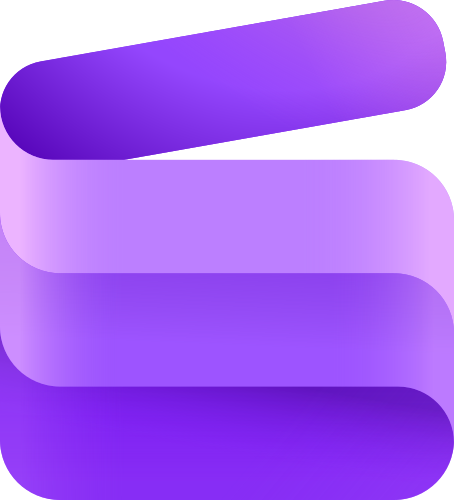 | `microsoft_clipchamp` | Microsoft Clipchamp |
| 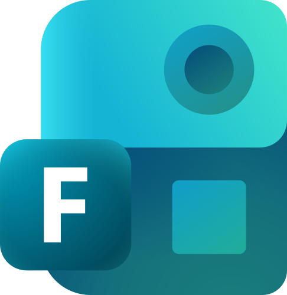 | `microsoft_forms` | Microsoft Forms |
|  | `microsoft_intune` | Microsoft Intune |
|  | `microsoft_whiteboard` | Microsoft Whiteboard |
|  | `onedrive` | OneDrive |
|  | `planner` | Planner |

## Power Platform (added)

| Icon | Identifier | Label |
| --- | --- | --- |
|  | `ai_builder` | AI Builder |
|  | `power_apps` | Power Apps |
|  | `power_pages` | Power Pages |

## Microsoft Viva

| Icon | Identifier | Label |
| --- | --- | --- |
|  | `microsoft_viva_engage` | Microsoft Viva Engage |

## Microsoft Fabric workloads

| Icon | Identifier | Label |
| --- | --- | --- |
| 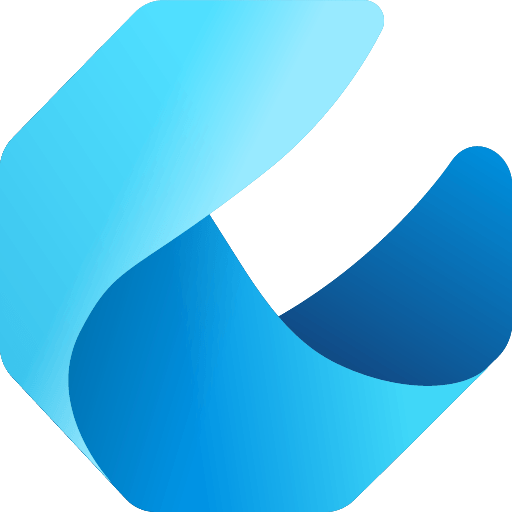 | `fabric_data_engineering` | Fabric Data Engineering |
|  | `fabric_data_factory` | Fabric Data Factory |
| 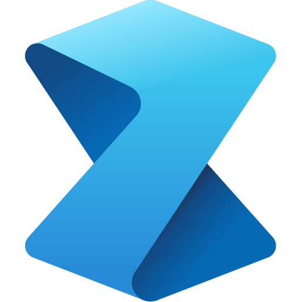 | `fabric_data_science` | Fabric Data Science |
| 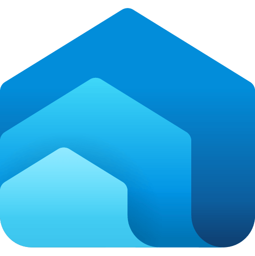 | `fabric_data_warehouse` | Fabric Data Warehouse |
| 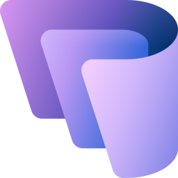 | `fabric_databases` | Fabric Databases |
|  | `fabric_iq` | Fabric IQ |
|  | `fabric_real_time_intelligence` | Fabric Real-Time Intelligence |

## Microsoft Entra (added)

| Icon | Identifier | Label |
| --- | --- | --- |
|  | `microsoft_entra_agent_id` | Microsoft Entra Agent ID |
|  | `microsoft_entra_id_governance` | Microsoft Entra ID Governance |
|  | `microsoft_entra_id_protection` | Microsoft Entra ID Protection |
|  | `microsoft_entra_internet_access` | Microsoft Entra Internet Access |
|  | `microsoft_entra_private_access` | Microsoft Entra Private Access |
|  | `microsoft_entra_verified_id` | Microsoft Entra Verified ID |
|  | `microsoft_entra_workload_id` | Microsoft Entra Workload ID |

## Dynamics 365 sub_apps

| Icon | Identifier | Label |
| --- | --- | --- |
|  | `dynamics_365_business_central` | Dynamics 365 Business Central |
|  | `dynamics_365_commerce` | Dynamics 365 Commerce |
|  | `dynamics_365_contact_center` | Dynamics 365 Contact Center |
|  | `dynamics_365_customer_insights` | Dynamics 365 Customer Insights |
|  | `dynamics_365_customer_service` | Dynamics 365 Customer Service |
|  | `dynamics_365_customer_voice` | Dynamics 365 Customer Voice |
|  | `dynamics_365_field_service` | Dynamics 365 Field Service |
|  | `dynamics_365_finance` | Dynamics 365 Finance |
|  | `dynamics_365_human_resources` | Dynamics 365 Human Resources |
|  | `dynamics_365_intelligent_order_management` | Dynamics 365 Intelligent Order Management |
|  | `dynamics_365_project_operations` | Dynamics 365 Project Operations |
|  | `dynamics_365_remote_assist` | Dynamics 365 Remote Assist |
|  | `dynamics_365_sales` | Dynamics 365 Sales |
|  | `dynamics_365_supply_chain_management` | Dynamics 365 Supply Chain Management |

## Azure misc (added)

| Icon | Identifier | Label |
| --- | --- | --- |
|  | `azure_lab_services` | Azure Lab Services |
|  | `azure_data_share` | Azure Data Share |
|  | `azure_data_manager_for_energy` | Azure Data Manager for Energy |

_243 technologies across 29 sections._

